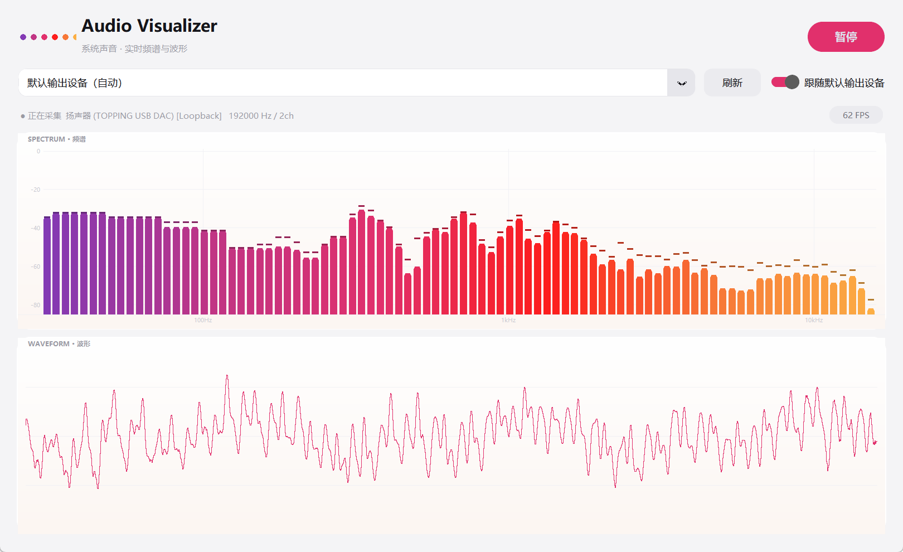

# 音频可视化 (Audio Visualizer)

自动识别电脑中**正在播放**的声音（无需选文件、无需虚拟声卡），实时显示：

- **频谱**：对数频率刻度柱状图，Instagram 风格紫→粉→橙渐变，带峰值保持
- **波形**：1px 细线示波器风格，自动增益（音量小时也会自动放大显示）



原理：Windows **WASAPI Loopback** 环回采集——直接从系统输出设备抓取正在播放的声音，
理论上能听到什么就采集什么（音乐、视频、游戏、网页声音都可以）。

## 快速开始

**方式一：直接用打包好的 exe（普通用户）**

下载 `AudioVisualizer.exe` 双击即可，不需要装 Python。

**方式二：源码运行（开发者）**

```text
1. 双击 install.bat      # 创建 venv 并安装依赖（首次一次即可）
2. 双击 start.bat        # 启动
```

环境要求：**Windows 10/11 + Python 3.10 ~ 3.13**（开发环境 Python 3.10.11）。

## 文件说明

| 文件 / 目录 | 作用 |
|---|---|
| `start.bat` | 启动可视化程序 |
| `install.bat` | 创建虚拟环境并安装依赖（首次运行一次即可） |
| `run_tests.bat` | 跑单元测试（不需要声卡） |
| `build_exe.bat` | 用 PyInstaller 打包成 `dist\AudioVisualizer.exe` |
| `main.py` | 程序入口（薄壳，真正实现在包里） |
| `audio_visualizer/` | 源码包，见下方「工程结构」 |
| `test_capture.py` | **硬件自检**：播放 440Hz 测试音并校验环回采集（需要声卡，手动运行） |
| `tests/` | 单元测试，全部不需要声卡，可用于 CI |
| `requirements.txt` | 运行依赖（带版本上下界） |
| `requirements.lock` | 已实测通过的精确版本，`install.bat` 优先装这一份 |
| `requirements-build.txt` | 打包用依赖 |

## 界面说明

- **采集设备**：默认「默认输出设备（自动）」，即自动跟随系统当前默认扬声器；
  也可以手动选择某个输出设备单独监听（列表里带采样率与声道数）。
- **跟随默认输出设备**：勾选后，切换系统默认扬声器时程序会自动跟着切换。
- **暂停**：冻结画面。
- 状态栏会显示当前设备、采样率、声道数，以及 PortAudio 的溢出/欠载计数。

## 工程结构

```text
audio_visualizer/
  config.py        常量与配色（无第三方依赖，方便测试直接 import）
  audio_engine.py  WASAPI 采集 + 设备异常恢复状态机
  dsp.py           环形缓冲区 / FFT / 波形 / DSP 工作线程
  renderer.py      numpy 帧缓冲 + Tk 上屏
  app.py           Tk 界面与主循环
tests/             单元测试（unittest，无外部依赖）
```

数据流：

```text
音频回调线程 -> 环形缓冲区 -> DSP 工作线程 -> 只保留最新一帧 -> Tk 主线程只负责显示
```

Tk 主线程里不做 FFT、不做降采样、不做增益计算，只把已经算好的结果画进 RGB 缓冲并上屏。

## 技术参数

- 采集格式：Float32，设备默认采样率（自动适配 48k/96k/192k），环形缓冲 32768 采样
- 多声道下混：逐采样取绝对值更大的声道（避免左右反相时平均互相抵消，同时保留符号供波形显示）
- FFT：2048~16384 点汉宁窗（按采样率自适应，保持约 43ms 时窗），
  每根柱子取该频段内 FFT bin 的最大值；有效数据不足一个完整 FFT 窗时不出图
- 频率范围：**30Hz ~ 16kHz**，第一根柱子从 ≥30Hz 的 bin 开始（不含 DC），
  最后一根柱子严格截断在 16kHz（不超过它，也不会一路吃到 Nyquist）
- 渲染：每帧用 numpy 整帧绘制进 RGB 缓冲，作为单张图片上屏；频谱/波形两张画布
  交替刷新（各 30Hz，总刷新 60/s）。装了 Pillow 时复用同一个 `PhotoImage` 对象
  （`paste` 原地更新），没装则退回 PPM 字节流
- 窗口缩放做了 160ms 防抖，拖动过程中不会每帧重建底图
- 界面：CustomTkinter 浅色 ins 风格

## 测试

```text
run_tests.bat
或
venv\Scripts\python.exe -m unittest discover -s tests -t . -v
```

覆盖内容：环形缓冲区读写顺序与有效长度、FFT 频率柱映射与 30Hz/16kHz 边界、
采样率变化、波形自动增益、设备状态机（重连 / 切设备 / 设备断开 / 枚举失败）、
渲染帧缓冲与上屏。全部使用假设备，不需要声卡，也不依赖真实音频硬件，
所以 `.github/workflows/tests.yml` 里直接在 CI 上跑（Python 3.10 / 3.12）。

需要验证真实采集链路时，单独运行 `test_capture.py`（会播放 3 秒 440Hz 测试音）。

## 打包 exe

```text
build_exe.bat
```

产物：`dist\AudioVisualizer.exe`（单文件，无控制台窗口）。运行期异常会写到 exe 同目录的
`error.log`。源码运行方式仍然保留。

## 常见问题

- **完全没有数据 / 找不到设备**：先运行 `test_capture.py` 看自检输出，
  确认系统有可用的音频输出设备。
- **频谱不动但电脑有声音**：检查程序顶部选择的设备是否是正在出声的那个
  （例如声音走的是蓝牙耳机，就选蓝牙耳机对应的设备）。
- **手动选择的设备被拔掉**：程序会在状态栏提示「设备已断开」并停止采集，
  **不会**偷偷切到别的设备；插回或重新选择后自动恢复。
- **状态栏出现「溢出 / 欠载」计数**：说明 PortAudio 回调出现 underflow/overflow，
  通常是系统负载过高。计数持续增长时可以在 `audio_visualizer/config.py` 里
  调大 `CALLBACK_FRAMES`。
- **画面卡顿**：程序按 60FPS 绘制，低端机器可把 `config.py` 里的
  `TICK_MS` 从 16 改为 33（约 30FPS）。
- **低频段相邻柱子数值一样**：48kHz 下 2048 点 FFT 的频率分辨率约 23Hz，
  比低频区的对数分频带还宽，所以一个 bin 会同时点亮相邻几根柱子。
  这是分辨率限制，不是 bug；需要更细的低频分辨可以调大 `FFT_WINDOW_SEC`。
